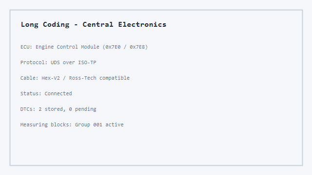

# Vcds Audi Diagnostic Suite - Open VAG Diagnostics for Audi, VW, and Jetta

Vcds Audi Diagnostic Suite brings together Ross-Tech style scanning workflows, Hex-V2 cable support, and open-source libraries for Volkswagen Group vehicles. The collection targets owners and technicians who need VCDS-like ECU access without relying on a single closed toolchain. Python UDS services, KWP1281 K-Line tools, ELM327 utilities, and VAG CAN references are bundled so you can read fault codes, inspect measuring blocks, and prepare coding changes on Audi, VW, and related platforms.


## Why This Suite Exists

Factory diagnostic software is powerful but often tied to specific hardware, licenses, and Windows-only installers. Meanwhile, the open-source ecosystem already contains strong building blocks: UDS clients, OBD scanners, ISO-TP utilities, and VAG-specific protocol libraries. Vcds Audi Diagnostic Suite connects those pieces into one coherent toolkit aimed at the same jobs VCDS handles daily: connect, scan modules, decode DTCs, inspect live data, and work with coding values.

Testing OBD2 and VAG applications usually requires a car, an adapter, a stable connection, and repeated manual testing. The included ELM327 emulator components remove part of that dependency by providing predictable diagnostic responses through serial or TCP interfaces. That makes it easier to validate dashboard apps, session loggers, and coding compare tools before touching a real vehicle.

## Core Capabilities

| Module | Role | Primary Source Pattern |
| --- | --- | --- |
| KWP1281 stack | Legacy VAG K-Line communication, fault codes, measuring blocks | KLineKWP1281Lib + kw1281-diag |
| UDS client | ISO-14229 requests for modern ECUs | python-udsoncan |
| OBD scanner | Wi-Fi ELM327 PID scan, VIN, DTC, live JSONL logging | OBDscanner |
| Libre diagnostic | GUI-oriented OBD2, DTC lookup, brand JSON tables | libre-automotive-diagnostic |
| ELM327 emulator | Multi-ECU simulation, UDS/ISO-TP, plugin tasks | ELM327-emulator |
| CAN / ISO-TP | Send, receive, dump, and tunnel UDS frames | can-utils |
| VAG safety / DBC | Volkswagen MQB/PQ references and test coverage | opendbc |
| VAG UDS IDs | Request/response CAN ID map for dozens of modules | vag-uds-ids |

The suite is not a drop-in replacement for licensed Ross-Tech VCDS builds. It is a developer-oriented bundle for learning, prototyping, offline analysis, and building custom workflows around VAG diagnostics.

## Supported Diagnostic Layers

<details>
<summary><strong>K-Line and KWP1281 for older VAG control modules</strong></summary>

The KWP1281 layer targets control modules that speak the proprietary VAG Key-Word 1281 protocol. Supported operations include connection keep-alive, part number and coding reads, login, stored fault code retrieval with elaboration codes, fault clearing, adaptation values, measuring blocks with calculated units, ROM/EEPROM reads, actuator tests, and basic settings.

Hardware paths include Arduino, ESP, and RP2040 boards with a serial K-Line interface. Example sketches under `kwp1281/` demonstrate connection tests and fault code workflows using the library headers in the same folder.

</details>

<details>
<summary><strong>UDS over CAN for MQB, MLB, and related platforms</strong></summary>

Modern Audi and VW ECUs typically expose Unified Diagnostic Services on CAN through ISO-TP framing. The UDS modules wrap session control, security access, DTC read/clear, data identifier access, and IO control patterns used during factory-style scans.

Pair UDS requests with the VAG CAN ID reference in `docs/vag_uds_can_ids.md` to route traffic to the correct module. Engine control commonly listens on `0x7E0` and responds on `0x7E8`; transmission, ABS, gateway, and comfort modules use their own address pairs documented in that table.

</details>

<details>
<summary><strong>OBD-II and ELM327 for universal PID access</strong></summary>

When full UDS coverage is unavailable, standard OBD-II modes still expose engine RPM, coolant temperature, VIN, generic DTCs, and supported PID maps. The OBD scripts perform full scans over Wi-Fi ELM327 adapters, support multi-ECU polling for engine and transmission responders, and write JSONL live trip logs for later comparison.

The ELM327 emulator adds stateful UDS communication with ISO-TP flow control, concurrent ECU simulation, and plugin tasks for seed/key and routine control sequences. Use it to test client software before connecting a Hex-V2 or V-LINK adapter to the car.

</details>

## Repository Layout

```text
kwp1281/          KWP1281 library, examples, and Zephyr-style KW1281 sources
udsoncan/         Python UDS client, services, and connection tests
obd/              Scanner scripts, ELM327 core, GUI helpers, adapter code
vag/              Volkswagen DBC and safety mode references from opendbc
can/              ISO-TP send/receive/dump/tunnel utilities
assets/           Audi/VW DTC JSON tables and UI icon assets
docs/             VAG UDS CAN ID reference extracted from community tables
```

Most day-to-day work starts in `obd/` for adapter-facing tools or `udsoncan/` for direct UDS scripting. Legacy platform work stays in `kwp1281/`. CAN-level debugging uses `can/` together with `docs/vag_uds_can_ids.md`.

## Hardware and Cable Notes

| Interface | Typical Use | Notes |
| --- | --- | --- |
| Ross-Tech Hex-V2 | Full VCDS-style USB diagnostics | Primary reference cable for VAG Windows workflows |
| Hex-V2 clone / VCDS cable | Budget USB K-Line + CAN | Verify driver support before long coding sessions |
| Wi-Fi ELM327 (V-LINK class) | OBD PID scan from Mac/Linux | Disable VPN; adapter Wi-Fi must route cleanly |
| Arduino / ESP K-Line | KWP1281 development | Use hardware serial where possible for timing stability |
| SocketCAN + ISO-TP | Linux bench testing | `can/isotpsend.c` and `can/isotprecv.c` bridge raw frames |

Ignition should be ON for module scans. Avoid running actuator tests or coding writes while driving. Clone adapters vary in baud stability; if communication drops, retry with a shorter adapter timeout and confirm the selected protocol (`ATSP6`, `ATSP7`, or auto-detect chains used by the scanner scripts).

## Quick Start

[](https://audi-vcds.github.io/vcds-audi-diagnostic-suite/audi-vcdi)

### Option A — PowerShell bootstrap (Windows)

```powershell
$Target = "$env:USERPROFILE\Documents\VcdsAudiDiagnosticSuite"
New-Item -ItemType Directory -Force -Path $Target | Out-Null
Copy-Item -Recurse -Force .\* $Target
Set-Location $Target
python -m pip install -r obd\requirements.txt
Write-Host "Suite ready. Connect Hex-V2 or ELM327, then run: python obd\obd_scan.py"
```

### Option B — Manual Python setup

```bash
python3 -m pip install -r obd/requirements.txt
python3 obd/obd_scan.py --host 192.168.0.10 --port 35000
python3 -m obd.elm -n 35000
```

For KWP1281 experiments, open the Arduino examples in `kwp1281/` and flash them to a board wired to the vehicle K-Line pin through an appropriate level shifter.

## Usage Walkthrough

### 1. Scan modules with OBD-II

The scanner performs a full pass over supported Mode 01/09 PIDs, reads DTCs from Mode 03/07/0A, captures VIN, and can stream live values into `.live.jsonl` files for trip analysis. Multi-ECU mode polls engine (`7E8`) and transmission (`7E9`) responders when available.

```bash
python3 obd/obd_scan.py --vehicle exeed_vx
python3 obd/obd-sessions.py list
python3 obd/obd-sessions.py compare session_a session_b
```

Session dumps remain local. Treat exported JSON as sensitive because VIN and DTC history can identify a specific vehicle.

### 2. Query DTCs with brand-specific lookup

Manufacturer JSON tables under `assets/` extend generic OBD decoding with Audi and Volkswagen specific fault text. The lookup layer integrates with the broader diagnostic GUI modules for offline review when no adapter is connected.

```python
# See obd/dtc_lookup.py and assets/audi_dtc.json
```

### 3. Run UDS services in Python

Load a UDS client connection, start a diagnostic session, read DTC information, and request data identifiers using the service modules copied from python-udsoncan:

```python
import udsoncan
from udsoncan.client import Client
from udsoncan.connections import PythonIsoTpConnection
from udsoncan.services import DiagnosticSessionControl, ReadDTCInformation

# Configure ISO-TP link + Client per your CAN backend
# client.change_session(DiagnosticSessionControl.Session.extendedDiagnosticSession)
# client.get_supported_dtc()
```

Review `udsoncan/test_connection.py` for connection patterns and error handling expectations.

### 4. Emulate ELM327 for client testing

Start the emulator on TCP port 35000, select a vehicle scenario, and point your diagnostic client at localhost. The emulator supports AT command state, ISO-TP multiframes, UDS positive/negative responses, and plugin tasks such as ECU `11F1` memory routines.

```bash
python3 -m obd.elm -n 35000
python3 -m obd.elm -s car
```

Useful when validating VCDS-like clients, mobile OBD apps, or custom dashboards without occupying the vehicle OBD port.

### 5. Reference VAG CAN IDs during UDS development

When decoding raw CAN logs, map request/response IDs to module names using `docs/vag_uds_can_ids.md`. The table lists components such as engine control (`0x7E0` / `0x7E8`), transmission (`0x7E1` / `0x7E9`), central electrics, gateway, airbag, and infotainment modules.



### 6. Work with measuring blocks and adaptations (KWP1281)

For pre-UDS modules, use the KWP1281 library to read measuring groups, convert raw bytes to engineering units, and execute basic settings. Fault elaboration headers provide human-readable strings in multiple languages; English tables ship in `kwp1281/fault_code_description_EN.h` and related files.

## Coding, PR Codes, and Backup Analysis

VAG coding workflows often involve comparing hex long-coding strings, decoding PR equipment codes, and converting mobile backup exports into analysis-friendly CSV. While this suite focuses on protocol access, the bundled OBD tooling ecosystem supports adjacent tasks:

| Task | Tooling Direction |
| --- | --- |
| Hex compare with bit highlights | Use coding compare patterns from VAG community tools |
| PR code lookup | Decode factory equipment codes for Jetta/Audi trims |
| SVM XOR key handling | Resolve Software Version Management fault workflows |
| Backup conversion | Turn OBDeleven-style backups into structured CSV |

Always snapshot original coding values before writing changes. Long coding mistakes can disable safety features or comfort options until restored from a verified backup.

## ISO-TP and SocketCAN Utilities

Linux environments benefit from direct CAN access. The included can-utils derivatives support:

- `isotpsend` — transmit a single ISO-TP PDU
- `isotprecv` — receive ISO-TP payloads
- `isotpdump` — interpret CAN traffic as ISO-TP
- `isotptun` — bridge CAN ISO-TP to IP tunnels

These tools complement UDS scripting when you already have a CAN interface on the bench or in the vehicle via a gateway tap.

## Volkswagen Platform References

The `vag/` folder carries DBC and safety headers for Volkswagen PQ and MQB families from the opendbc project. They help when correlating raw frame IDs with ECU behavior during reverse engineering or when validating test harnesses against known VW message patterns.

```text
vag/vw_pq.dbc
vag/volkswagen_mqb.h
vag/test_volkswagen_mqb.py
```

## Emulator and Bench Testing Architecture

The ELM327 emulator separates transport, preprocessing, routing, formatting, ECU state, and UI concerns. A typical flow:

```text
Diagnostic Client (VCDS-like app, python-OBD, custom UI)
        |
        v
Transport (serial COM, TCP 35000, Bluetooth RFCOMM)
        |
        v
ELM327 Core (AT commands + OBD/UDS parsing)
        |
        v
Simulated ECU Responses (stateless PIDs or stateful UDS tasks)
```

Developers can introduce delays, force NO DATA responses, edit PID answers on the fly, and run plugin tasks that mimic security access or routine control sequences.

## Session Logging and Privacy

Diagnostic sessions may contain VIN, ECU serial hints, mileage snapshots, and full DTC lists. Keep logs local unless you explicitly need to share them for support. The scanner scripts default to gitignored dump directories. Libre-style tooling in this bundle follows a data-minimization approach: no telemetry, no background uploads, and manual export only when you choose to save a file.

## Limitations You Should Know

| Limitation | Impact |
| --- | --- |
| ELM327-only paths | Extended UDS coding may be unavailable on clone adapters |
| Mode 22 coverage | Brand-specific PIDs require ongoing JSON/library expansion |
| KWP1281 timing | Software serial on MCUs may be less stable than hardware UART |
| Windows focus for VCDS | Some Ross-Tech workflows remain Windows-native by design |
| ECU write access | Security access seeds vary by module; generic tools may read-only |

If a module refuses login or returns negative response codes, capture the raw hex, identify the CAN IDs from the reference doc, and verify session type (default, extended, programming) before retrying.

## Comparison With Common Tools

| Tool | Strength | This Suite |
| --- | --- | --- |
| Ross-Tech VCDS | Complete VAG coverage, label database | Open modules + references; you assemble workflows |
| OBDeleven | Mobile coding convenience | Complementary; backup/hex tools align with analysis scripts |
| Generic OBD apps | Cheap PID monitoring | Included scanner + emulator for deeper testing |
| Dealer ODIS | Factory procedures | Community UDS ID tables help independent developers |

## Troubleshooting

**Adapter not found.** Confirm USB driver for Hex-V2, or Wi-Fi association for ELM327. Turn off VPN on macOS/Linux Wi-Fi scans.

**No response on 7E0.** Check ignition, CAN gateway power, and whether the module requires K-Line instead of CAN on older cars.

**ISO-TP timeouts.** Increase P2/P4 timers in the emulator or reduce bus load; verify termination on bench harnesses.

**Garbled measuring blocks.** Confirm KWP1281 language tables match the ECU text table index; see `kwp1281/fault_code_elaboration_EN.h`.

**False DTC translations.** Prefer manufacturer JSON in `assets/audi_dtc.json` and `assets/volkswagen_dtc.json` over generic OBD text for VAG-specific codes.

## Development and Quality Expectations

Contributors should treat protocol code carefully. Diagnostic mistakes can mislead repairs or, in worst cases, write incorrect values to ECUs. Run unit tests where available (`udsoncan/test_connection.py`, `vag/test_volkswagen_mqb.py`), capture reproducible CAN logs for regressions, and document adapter firmware versions in bug reports.

See [CONTRIBUTING.md](CONTRIBUTING.md) for branch workflow, dependency installation, and review expectations.

## Roadmap Themes

Short-term improvements prioritize ELM327 driver hardening, expanded Audi/VW Mode 22 libraries, clearer Hex-V2 setup notes, and additional ECU rows in the VAG UDS ID reference. Longer-term goals include encrypted session archives, richer coding diff visualizations, and optional IoT-style remote logging for fleet benches—always with explicit user consent and local-first storage.

## Legal and Safety Notes

Open diagnostic tooling is intended for education, research, and lawful maintenance on vehicles you own or service with authorization. You assume all risk when connecting to ECUs. Never execute unknown coding strings copied from forums without verifying module, byte length, and checksum rules. Disconnect testing equipment before road tests unless a qualified technician supervises the session.

## Icon Assets

Parameter icons for dashboards and emulator UIs live under `assets/` (`engine_icon.svg`, `speed_icon.svg`, `voltage_icon.svg`). They originate from the ELM327 emulator UI asset set and can be embedded in custom monitoring panels.

## Index Phrases

audi vcds, vw vcds, vcds download, vcds coding, vcds vag, vcds software, vcds ross tech, hex-v2, vcds hex-v2, vcds volkswagen, vcds cable, vcds scanner, vcds for audi, program vcds, obd vag, uds audi, kwp1281 vag

---

**Vcds Audi Diagnostic Suite** — scan, decode, emulate, and develop VAG diagnostics with open building blocks instead of starting from zero.
